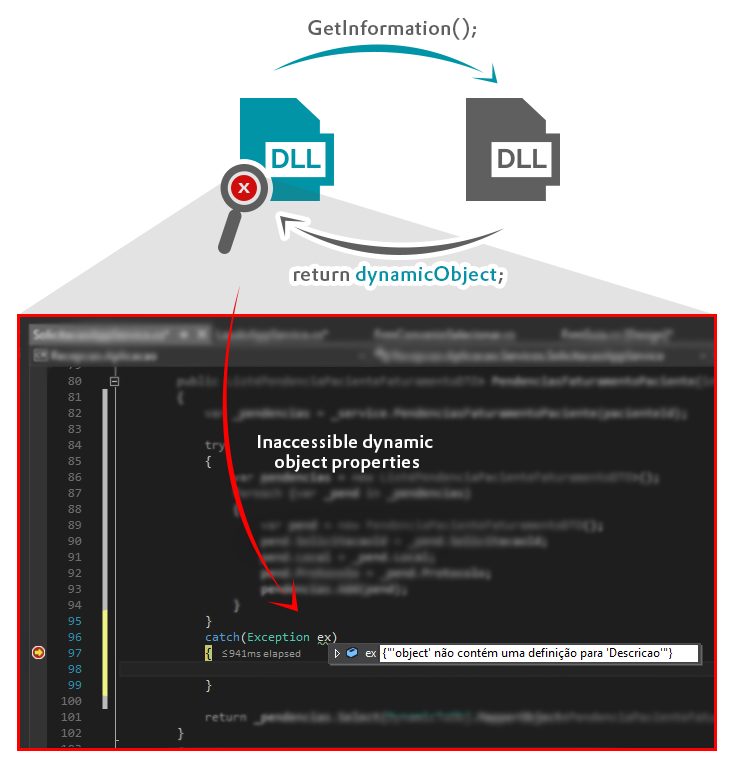

# DynamicToObject (V1.0.0)
Class that converts a dynamic object to a typed object.

---

### Install (npm)
```
npm install dynamicToObject
```

### Issue


### Usage
```c#
  DynamicToObj.MapperObject<PendenciaPacienteFaturamentoDTO>(objDynamic);
```

---
:pray: [Donate to help](https://www.paypal.com/cgi-bin/webscr?cmd=_donations&business=ericferreira1992%40gmail%2ecom&lc=BR&item_name=Eric%20Github&currency_code=BRL&bn=PP%2dDonationsBF%3abtn_donateCC_LG%2egif%3aNonHosted)

:email: [Send email to support](ericferreira1992@gmail.com)
